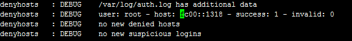
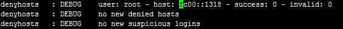
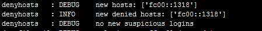
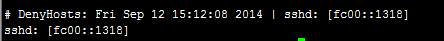

Denyhosts-ipv6
==============

Clone from http://sourceforge.net/projects/denyhosts/files/. 

Add ipv6 support. Base On Denyhosts 2.6 Version.

Just test in Debian 6.

1. success login  

2. failed login  

3. lock ipv6   

4. hosts.deny  
    
